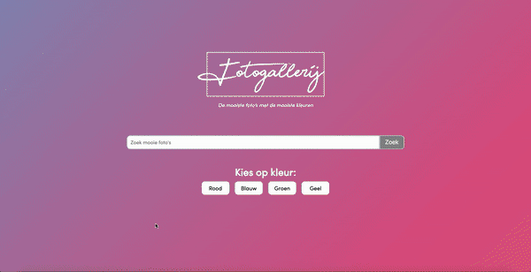

# Frontend voor Designers - opdracht 1
Ik heb gekozen voor de opdracht: 
Als ik foto's zoek wil ik kunnen selecteren op kleur om verassende zoekresultaten te krijgen.

Ik heb een fotogallerij site gemaakt, waarbij je foto's kan filteren op kleur en foto's groot kunt bekijken. 
**Feedback bij versie 1:**
- Filter werkt nog niet helemaal goed
- Snapt niet waar de site over gaat, mist een titel of logo
- Kan filter niet wegklikken
- Foto's laden heel langzaam
- Ziet niet op welke kleur je hebt gefilterd

[Link V1](https://kimgarrard.github.io/frontendvoordesigners/opdracht1/v1/)

**Verbeterd bij versie 2:**
- Filter werkt goed (door middel van for loop)
- Kan filter wegklikken
- Logo met stukje tekst toegevoegd
- Achtergrondkleur verandert per kleur (op rood filteren is een rode gradient achtergrond)
- Gradient animatie in de achtergrond
- Foto kan vergroten als je erop klikt
- Website is responsive

[Link V2](https://kimgarrard.github.io/frontendvoordesigners/opdracht1/v2/)

# Principles of User Interface Design
**04 - Keep Users in control**

Humans are most comfortable when they feel in control of themselves and their environment. Thoughtless software takes away that comfort by forcing people into unplanned interactions, confusing pathways, and surprising outcomes. Keep users in control by regularly surfacing system status, by describing causation (if you do this that will happen) and by giving insight into what to expect at every turn. Don't worry about stating the obvious…the obvious almost never is.

Dit heb ik toegepast doordat de gebruiker bepaalt: hij / zij kan de foto's bekijken en ook groter bekijken. Ook kan de gebruiker zoeken en filteren op kleur, deze aanpassingen kunnen ook weer hersteld worden. Op deze manier heeft de gebruiker de controle: hij / zij kan zelf input geven en deze ook weer herstellen. 

**11 - Strong visual hierarchies work best**

A strong visual hierarchy is achieved when there is a clear viewing order to the visual elements on a screen. That is, when users view the same items in the same order every time. Weak visual hierarchies give little clue about where to rest one's gaze and end up feeling cluttered and confusing. In environments of great change it is hard to maintain a strong visual hierarchy because visual weight is relative: when everything is bold, nothing is bold. Should a single visually heavy element be added to a screen, the designer may need to reset the visual weight of all elements to once again achieve a strong hierarchy. Most people don't notice visual hierarchy but it is one of the easiest ways to strengthen (or weaken) a design.

Dit heb ik toegepast door de knoppen en de filters wit te maken: hierdoor steken deze uit op de achtergrond. Door kleurgebruik vallen deze op. Verder heb ik ook de achtergrondkleur aangepast op de kleur waarop je filtert: hierdoor wordt de site met de kleuren een mooi geheel en is het gelijk duidelijk op welke kleur je hebt geklikt. 

